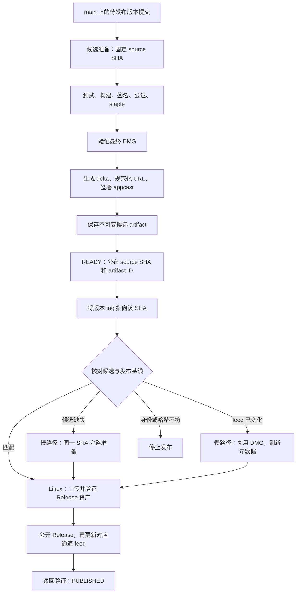

# 候选产物预构建与快速版本发布

状态：2026-09-12 已在工作区实现候选优先发布及 stable/alpha/beta 通道；真实 CI 签名、公证、升级和一分钟目标尚待验收。实际命令与边界以 [发布手册](release.md) 为准。本文保留设计依据、预算与后续验收计划。

## 1. 目标与适用范围

把测试、打包、Developer ID 签名、Apple 公证、staple、成品验证和 Sparkle 增量包生成放到打 tag 之前。正式发布时，复用已经验证的候选产物，只做身份核对、上传和更新源切换。

目标是**候选产物已就绪时，从 tag 触发到 GitHub Release 与 Sparkle feed 都可用，争取低于 60 秒**。10～30 秒是快速发布执行阶段的优化目标，尚未实测；runner 排队、GitHub 网络和缓存传播仍可能使总时间超过一分钟。候选准备时间单独展示，不从端到端指标中隐藏。

本阶段覆盖现有 macOS arm64、macOS 14.0+ 发布，兼容当前 Python/py2app 与正在集成的 Rust 后端。保留现有原生音频 C ABI、GPL-3.0-only 许可证、Developer ID 身份和 Sparkle 公钥。Windows 发布与 GPUI 前端迁移另行推进。

### 当前基线

下表来自本次检查的 GitHub Actions 运行及日志，不包含尚未提交的 Rust 发布改动，也不包含排队时间。

| 版本 | Job 总执行 | 前后端检查 | 构建并签名 DMG | 公证及 staple |
| --- | ---: | ---: | ---: | ---: |
| [0.4.17](https://github.com/sm-yjr/vocal-more/actions/runs/34364490477) | 267 秒 | 34 秒 | 98 秒 | 51 秒 |
| [0.4.16](https://github.com/sm-yjr/vocal-more/actions/runs/34175052209) | 240 秒 | 30 秒 | 75 秒 | 51 秒 |
| [0.4.15](https://github.com/sm-yjr/vocal-more/actions/runs/34173594200) | 240 秒 | 35 秒 | 89 秒 | 51 秒 |

快速发布必须连 Sparkle 增量包生成和 feed 签名一起前移；只缓存 DMG，仍会在正式发布时承担更新元数据准备成本。

## 2. 总体流程



采用 GitHub Actions artifact 保存候选，首次实现不在准备阶段创建正式版本的 draft Release。这样准备流程无需 `contents: write`，也不会提前创建 tag 或占用版本 Release。正式发布才创建 draft、上传资产、公开 Release。Artifact 是发布交接物；依赖 cache 只负责提速，不能充当交接物。

### Workflow 分工

以下文件已实现，提交并推送到 GitHub 后启用：

| 文件 | 触发与职责 | Runner / 权限 |
| --- | --- | --- |
| `release-prepare.yml` | `push: main`、手动指定 `source_sha`；预检后调用公共候选流程 | 预检 Linux；`contents: read`、`actions: read` |
| `_release-candidate.yml` | `workflow_call`；执行完整准备或仅刷新更新元数据，输出 artifact ID | macOS arm64；构建时使用现有签名、公证与 Sparkle secrets |
| `release.yml` | 版本 tag 或手动重试；解析候选，必要时调用公共流程，再发布 | 正常路径 Linux；发布 job 才授予 `contents: write`，候选读取用 `actions: read` |

公共流程不写 GitHub Release 或稳定 feed。它与正式发布 job 分离，Linux 发布 job 不需要 Apple 或 Sparkle 私钥，也不执行候选中的程序。

## 3. 候选什么时候准备

1. 开发者更新 `pyproject.toml`、`uv.lock` 中的本项目版本，以及非空的 `docs/releases/<version>.md`，提交到 `main`。
2. 每次 `main` push 先运行轻量预检：版本已经正式发布则跳过；版本尚未发布且说明完整则准备候选。待发布期间的后续提交都重新按其 SHA 准备，不能只过滤版本文件变更，否则代码或文档新提交可能没有对应候选。
3. 手动入口从 `main` 的 workflow 发起，接受完整 `source_sha`；校验它属于本仓库且可从 `main` 历史到达，再精确 checkout。此约束同样适用于 tag 的完整准备慢路径。PR、fork 和未合入分支不进入持有签名 secrets 的准备路径。
4. stable 默认 tag 为 `vX.Y.Z`；项目 `X.Y.ZaN` / `X.Y.ZbN` 分别映射到 `vX.Y.Z-alpha.N` / `vX.Y.Z-beta.N`。允许裸 tag 和 PEP 440 别名，但必须解析为完全相同的项目版本。
5. 全部验证及 artifact 上传完成后，workflow 成功结束，才对外认定 `READY`。Summary 提供版本、完整 SHA、artifact ID 和预计 tag；manifest 记录 run/attempt 和准备完成时间。

普通 `main` push 中，workflow 的 `head_sha` 与 `source_sha` 通常相同；手动为历史提交准备时可能不同。Manifest 必须分别记录**workflow 来源 SHA**和**产品源码 SHA**，发布校验不能混用二者。所有产品版本、说明与源码都从实际 checkout 的 `source_sha` 读取。

正常用法是先看到 `READY`，再把 tag 指向 Summary 中的完整 SHA。即使 `main` 已前进，也不能把 tag 改指向新的 HEAD 后继续复用旧候选。

## 4. 准备阶段保留哪些验证

完整准备复用当前脚本，顺序如下：

1. 校验源码 SHA、项目版本、锁文件中的项目版本、release notes 和预计 tag；在安装依赖前快速失败。
2. 安装锁定的工具链与依赖，完成前端检查、Python 测试，以及集成后的 Rust 检查和测试。Python/Rust 集成测试所需二进制必须先构建，不能因不存在而静默 skip。
3. 生成前端产物，使用独立且锁定的 production packaging venv，执行 `build_dmg.sh`。将 Rust release 后端及原生 dylib 纳入最终 App 签名范围。
4. 对最终 DMG 公证并 staple，执行 `verify_release_artifact.py`，保存结构化验证结果。覆盖现有架构、最低系统版本、C ABI、动态库依赖、嵌套签名和 Rust 产品版本检查；补齐 App 与 DMG 根目录的许可证检查。
5. 此后固定 DMG 字节，再生成 Sparkle 增量包和签名元数据。任何重新签名、压缩或再次修改 DMG 都使后续摘要和 Sparkle 签名失效，必须重新验证和生成候选。
6. 验证全部候选文件，生成 manifest，上传一个完整的候选 artifact。禁止使用 `if: always()` 把失败构建作为可发布候选上传；失败诊断文件使用不同命名空间。

继续保留前后端检查并行、跳过重复前端构建和中间 ad-hoc 签名。本次加入 Cargo 缓存；图标按输入哈希复用仍是后续优化。签名暂时保持当前串行策略，避免重新引入 py2app 硬链接竞态。

公共候选 workflow 已显式安装 Rust 1.90.0 的 `rustfmt` component，避免依赖 runner 的预装组件。

## 5. 候选文件与身份契约

Artifact 名称采用 `release-candidate-<version>-<full-sha>-<run-id>-<attempt>`，保留 14 天，且不超过仓库允许的保留期。使用独立 artifact ID；重跑产生新 artifact，不覆盖旧候选。下载和恢复规则依据 [GitHub artifact 文档](https://docs.github.com/en/actions/tutorials/store-and-share-data)。

```text
candidate/
  manifest.json
  verification.json
  release-notes.md
  Vocal-More-<version>.dmg
  <Sparkle 生成并规范化后的名称>.delta
  appcast.xml
  baseline-appcast.xml
```

`baseline-appcast.xml` 是准备时读取的旧 feed，用于基线对比和故障恢复。当前仓库已有稳定 feed，读取失败应报错；仅当该通道没有已发布版本和 feed 时允许基线为空，首次 alpha/beta 自动识别；快照文件用非空 XML 注释标记此状态。密钥、证书、钥匙串及认证配置不进入 artifact。

Manifest 使用版本化 JSON 契约，至少记录以下字段：

| 字段 | 内容及用途 |
| --- | --- |
| `schema_version` | 首版为 `1`；未知版本拒绝发布 |
| `repository` / `source_sha` | 本仓库标识、产品完整 commit SHA |
| `version` / `release_tag` | 产品版本和确切 URL tag，保留是否带 `v` |
| `producer` | 入口 workflow path、workflow head SHA、run ID、attempt 和事件；最终运行结论由发布端向 GitHub 查询 |
| `build` | runner 镜像、arm64、最低 macOS、Python/uv/Rust/Sparkle 版本，以及关键锁文件与打包脚本摘要 |
| `policy` / `verification.json` | manifest 保存验证策略版本；报告保存公证 submission ID / Accepted 结果、验证时间和最终 DMG 摘要 |
| `baseline` | 前一正式版本及确切 tag、DMG asset ID / SHA-256、旧 feed SHA-256 |
| `files` | 每个 payload 文件的名称、字节数和 SHA-256；角色由白名单文件名及扩展名限定 |
| `prepared_at` / `expires_at` | 候选准备时间和最多 14 天的使用期限 |
| `origin_candidate` | 仅刷新元数据时，原候选 artifact ID、run、摘要和验证来源 |

`files` 包含验证报告、release notes、DMG、delta、签名后的 appcast 和旧 feed，不包含 manifest 自身。整个 archive 的 digest 与 artifact ID 在上传后由 GitHub API 提供，不能要求 manifest 预先包含自己的最终 digest。

GitHub API 返回 artifact 的 run 来源和 SHA-256 digest；发布端验证下载 archive 的 digest、安全解包、逐文件核对 manifest，并向 GitHub 核验 producer 与 artifact 的来源关联。`download-artifact` 的自动摘要检查在不匹配时可能仅给出 warning，因此发布脚本必须显式失败，不能只依赖 action 的绿色状态。[Artifact API](https://docs.github.com/en/rest/actions/artifacts)、[摘要校验行为](https://docs.github.com/en/actions/tutorials/store-and-share-data#validating-artifacts)

### 来源核验规则

- 只查询本仓库允许的候选 workflow 及成功运行；同时校验 run 的仓库、事件、workflow path、attempt、workflow head SHA 与 manifest 来源信息。
- 产品 `source_sha` 必须等于 tag 解引用后的 commit SHA；版本、notes、构建策略也必须对应。不能只凭文件名、`READY` 字样或 manifest 中的 `passed: true` 信任产物。
- 手动入口允许 workflow SHA 与产品 SHA 不同，但源码必须满足第 3 节的 `main` 历史约束。发布工具对允许的 workflow 与验证策略版本设显式白名单。
- 解包时拒绝路径穿越、符号链接、重复路径及清单外文件；字段作为数据解析，不执行文件中的 shell 或程序。
- 多个候选匹配同一 SHA 时，过滤过期和未完成/不允许的来源，按 artifact 创建时间与 ID 选择最新匹配项。其基线过期则刷新元数据，身份或摘要异常则停止；workflow 手动入口不提供任意 artifact ID 绕过选择器。
- 慢路径在**当前发布 run 内**调用公共准备流程时，父 run 尚未结束。此时通过成功的 `needs` 依赖和明确输出的 artifact ID 接收产物，不要求父 run 已经 completed；预构建入口的候选必须来自已成功结束的运行；release 入口即使在候选完成后发布失败，只要该 attempt 的 `seal-candidate` job 成功，其不可变候选仍可恢复。

## 6. 提前生成 Sparkle 更新

通过 `packaging/release/feed.py`，直接读取源码中的 release notes；不再依赖目标 GitHub Release 已创建。工具继续使用已锁定且校验下载摘要的 Sparkle。

1. 读取目标通道 feed 和版本，排除 draft 与 feed 容器，检查 alpha/beta 的 prerelease 标记，按解析后的版本比较，不使用字符串排序或列表第一个元素推断版本。
2. 固定前一版 DMG 的确切 asset 身份与哈希，下载并验证；继承旧 feed 的历史条目，维持最多 5 个版本、前一版 1 个 delta、LZFSE 压缩的当前策略。
3. 对已经 staple 的最终 DMG 运行 `generate_appcast`。下载 URL 提前使用 manifest 中的真实目标 tag，目标 URL 此时可以尚未上线。
4. 规范化资产名称与 URL，嵌入 notes，再签署整个 appcast 并验证；之后不再修改 XML。准备阶段验证 full DMG 和 delta 的 Sparkle 签名，并执行 delta 应用后的目标一致性验证。
5. 保存最终 feed、旧 feed 及所有文件摘要，完成候选。

候选中的 `pubDate` 使用准备阶段确定的时间，正式发布时间另记入发布回执。Linux 发布阶段不为更新日期而重写已签署的 feed。

`normalize_appcast_urls.py` 已接受版本到真实 tag 的映射，保留历史条目的真实 URL。默认预备 `v0.4.18` 后却推送 `0.4.18` 时，必须刷新并重新签署 feed；不能在 Linux 发布阶段直接替换 XML 字符串。

有可用历史 DMG 却未生成 delta，仍然视为准备失败，保留当前发布约束。Sparkle 要求归档和启用 `SURequireSignedFeed` 的 feed 正确签名，步骤不能互相替代。[Sparkle 发布文档](https://sparkle-project.org/documentation/publishing/)

### 基线变化

候选 `0.4.19` 基于 `0.4.17` 准备后，如果 `0.4.18` 先发布，则 `0.4.19` 的旧 feed 与 delta 基线都已过时。发布端重新读取正式版本和 feed 摘要，标记 `STALE_BASELINE`，不能覆盖新 feed。

此时进入 `refresh-feed` 慢路径：验证原候选来源及 DMG 摘要，在 macOS 上重新验证该 DMG，针对最新基线生成 delta 和签名 feed，产出新 artifact。产品 SHA、版本和 DMG 字节保持相同；`origin_candidate` 记录原验证链。刷新不能延长原 DMG 的候选有效期，不能把失败或过期的原候选变成可信来源。

若发现上一版本的 Release 已公开但 feed 尚未完成，暂停新版本发布，先恢复该版本，避免把半完成发布当作正常基线。

## 7. tag 发布与慢路径

`release.yml` 保留 tag 触发与手动入口，手动参数增加 `mode`：

| 模式 | 行为 |
| --- | --- |
| `auto`，默认 | 候选匹配则快速发布；缺失或过期则完整准备；基线或 tag URL 不匹配则刷新元数据 |
| `require-ready` | 只允许匹配候选；未就绪时退出并给出原因，用于测量快速路径 |
| `rebuild` | 目标尚无 Release 或只有空 draft 时，从确切 tag SHA 完整准备；已有资产则拒绝该模式，使用 `auto` 恢复，不覆盖不同字节 |

候选仍在准备、未成功结束时不能提前使用。`auto` 会明确显示 `FULL_PREPARE: CANDIDATE_NOT_READY` 后走慢路径，可能产生一次重复准备；正常操作应先等待 READY。一次只选择一种路径，不能在校验失败后轮换其他候选直到碰到成功。

发布顺序：

1. 获取全仓库各通道共用的发布锁；解析真实 tag，包括 annotated tag 的解引用，记录完整 SHA，再读取该提交的版本与 notes。
2. 解析候选或完成慢路径，核对来源、所有文件哈希、有效期、版本、tag 名和当前基线。
3. 创建目标版本的 draft Release，上传 DMG、delta、manifest 与验证报告。逐个核对远端名称、大小、`uploaded` 状态和 SHA-256；重跑时同名同哈希跳过，同名不同哈希停止。GitHub 暂未提供 digest 时下载远端资产算哈希，允许因此超过快速预算。
4. 再次确认 tag 未移动、基线未变化；公开 Release，并确认 DMG 与 delta 的公开 URL 可读取。只有资产就绪后才允许更新 feed。
5. 备份旧 feed，更新对应通道的 `appcast.xml`，读回并核对最终字节摘要及目标版本。Linux 依赖准备阶段验证过的签名和完全相同的字节，不在这里重新签名。
6. 写入发布回执并标记 `PUBLISHED`。回执记录 tag/SHA、candidate/run/artifact ID、DMG/delta/feed 摘要、notary submission、快慢路径原因和各阶段耗时。

正常 Linux 路径不安装项目依赖，不运行测试、py2app、Cargo、codesign、notarytool 或 `generate_appcast`；它确认收到的字节就是前一阶段完整验证的产物。官方 Release API 支持 draft 状态，资产 API 提供 digest 字段；本次已确认当前 0.4.17 的 DMG 和 delta 都具有 digest。[Release API](https://docs.github.com/en/rest/releases/releases)、[资产 API](https://docs.github.com/en/rest/releases/assets)

## 8. 并发、重试与更新源恢复

所有修改正式 Release 或稳定 feed 的入口，包括兼容慢路径和修复入口，使用同一个 workflow 级别的锁：

```yaml
concurrency:
  group: vocal-more-release-publication
  cancel-in-progress: false
```

公共候选流程不再次取得这把锁，避免父 workflow 等待子 workflow 的死锁。actionlint 1.7.12 尚不接受 `queue: max`，本次配置采用默认单 pending 行为：新 pending 可能替换旧 pending，不保证 FIFO 或完整排队；被替换请求需手动重试。无论队列行为如何，仍按版本单调性阻止旧版本覆盖新 feed。[并发规则](https://docs.github.com/en/actions/how-tos/write-workflows/choose-when-workflows-run/control-workflow-concurrency)

Release 与 feed 之间没有事务，`gh release upload --clobber` 会先删除旧资产再上传，失败时旧资产可能丢失。因此不能声称本方案实现无间断的原子切换。[GitHub CLI 行为](https://cli.github.com/manual/gh_release_upload)

处理规则：

| 状态或故障 | 处理 |
| --- | --- |
| 测试、公证、成品验证失败 | 不产生 READY，不创建正式 Release，不改 feed |
| 候选 SHA、digest、策略或来源不符 | 硬失败；不自动重建来掩盖校验异常 |
| 版本 tag 在执行期间移动 | 硬失败；不能将旧候选发布到新 SHA |
| draft 资产上传中断 | 保留 draft；重试仅补齐缺失资产，已存在的资产必须同哈希 |
| Release 已公开、feed 尚是旧基线 | 标记 `RELEASE_PUBLISHED_FEED_PENDING`；确认资产一致后只补做 feed，不能重建 DMG |
| 当前 feed 已等于目标摘要 | 校验 Release 资产后幂等成功；回执丢失也可恢复 |
| 当前 feed 比目标版本更新 | 旧版本重试不得回写；报告已被后续版本取代 |
| feed 替换失败或读回不符 | 同一发布锁内重试；恢复备份前确认没有第三方新 feed，禁止盲目覆盖 |
| feed 资产缺失且 runner 已退出 | 下次恢复使用候选中的旧 feed 和已持久化的上传前备份；若无法确认身份则停止并报告需处理 |

上传新 feed 前，把读取到的旧 feed 字节及恢复信息保存到独立诊断 artifact，并保留至少 30 天；恢复信息只包含版本、资产 ID 与摘要。`finally` 内尝试恢复不能代替下次运行的恢复逻辑，因为 runner 可能被强制停止。

自动恢复仅适用于 feed 缺失或仍为本次目标/基线的情况。发现另一个不同摘要的 feed 时停止，重新判断发布状态。工作流锁不能约束手工在 GitHub UI 修改资产，必须在关键写入前再次读取状态。

已公开的 DMG/delta 不使用 `--clobber` 替换。产品缺陷通过新版本修复；恢复 feed 只是修复发布中断，不能让已升级用户自动降级。

## 9. 开发者使用方式

以下命令是已实现流程的示例，`candidate_sha` 必须替换为候选 Summary 给出的完整 SHA；版本号也要与该候选一致。

```bash
# 版本与 release notes 提交到 main 后，等待候选 workflow 显示 READY。
# 为确切候选创建 tag；不隐式使用本地 HEAD。
candidate_sha='替换为 READY 中的完整 SHA'
git tag -a v0.4.18 "$candidate_sha" -m "Vocal More 0.4.18" &&
  git push origin refs/tags/v0.4.18
```

手动重试选择 `release.yml`，输入已存在的 `release_tag`。默认 `auto` 恢复已有发布状态；需要明确一分钟路径时选择 `require-ready`。禁止通过移动 tag 或更换同版本二进制来修复准备错误。

GitHub Actions Summary 使用简体中文展示：`候选已就绪`、`快速发布`、`完整准备：候选缺失`、`刷新元数据：基线变化`、`Release 已公开，更新源待恢复`、`发布完成`，并提供相关运行与 Release 链接。

## 10. 耗时指标与验收

回执记录 `prepare_seconds`、`initial_queue_seconds`、`publish_execution_seconds`、`run_to_published_seconds`、tag push 专有的 `tag_trigger_to_published_seconds`，以及 `prepare_to_published_seconds`。`initial_queue_seconds` 仅反映 run 初始排队，不包含所有依赖 job 排队；tag 指标从 GitHub run 创建开始，具体口径见发布手册。计时终点必须是公开资产和签名 feed 都读回成功。

| 正常快速路径阶段 | 初始预算，待实测 |
| --- | ---: |
| runner 启动、来源查询、候选解析 | 5～10 秒 |
| 下载候选和本地摘要验证 | 3～10 秒 |
| 上传并核验 Release 资产 | 5～15 秒 |
| 公开 Release、备份并切换 feed、读回 | 5～15 秒 |

目标为快速路径执行 P50 ≤ 30 秒、P95 ≤ 50 秒；只有排队及传播开销足够小时，tag 到全部可用才能小于 60 秒。先用至少 10 次隔离的发布演练记录每个样本及中位数、最大值，再随正式发布积累 P95；少量演练结果不能证明稳定的一分钟服务保证。

同时报告候选命中率、快速路径一分钟达标率和全部发布的一分钟达标率。慢路径单独标记；快速路径中的排队、网络慢和失败仍计入相应分母，不能通过排除异常样本改善数字。

实现验收至少覆盖：

- 同一版本两个 SHA、annotated tag、裸版本 tag、移动 tag、手动历史提交与 workflow SHA 不同。
- 候选缺失/过期、来源错误、archive digest 错误、文件摘要错误、失败运行留下的同名 artifact、当前 run 慢路径依赖成功。
- 基线版本变化、旧版本重跑、前一个 Release 已公开但 feed 未完成、已有同名资产不同字节。
- 在 draft 上传、公开 Release、删除旧 feed、上传新 feed、写回执之间分别注入失败，确认恢复不会覆盖其他版本。
- 真实 macOS 候选完成签名、公证、staple、最终产物验证，且升级测试验证上一正式版本的 delta 可用、full DMG 回退仍可用。
- Linux 发布 job 仅校验和上传，公开资产摘要与候选一致，稳定 feed 签名和下载链接最终有效。

协议与故障测试使用本地 fixture 或隔离的测试仓库，不通过推送生产版本 tag 来跑测试。真实打包、公证和安装验证由 CI 演练完成；不为这次设计或日常验证在本地构建 DMG。

## 11. 实施状态与后续验收

1. **已实现：** 版本和通道契约、候选来源/摘要验证、公共 macOS 准备、Linux 发布、元数据刷新、失败恢复和中文操作手册。
2. **已加入：** 本地故障注入测试覆盖候选路由、通道隔离、过期/篡改、tag 移动、同名资产冲突、feed 替换失败和 runner 中断后的恢复。
3. **待 CI 验收：** 真实 macOS 签名、公证、staple、增量升级和完整包回退；需实际版本或隔离环境，不能用离线 fixture 代替。
4. **待测量：** 快速发布至少 10 个样本的耗时和命中率；实际结果出来后再评估预上传 draft、图标缓存等优化。

实际文件边界：

| 文件 | 实施职责 |
| --- | --- |
| `packaging/release/candidate.py` | 版本化 manifest、文件摘要、候选来源及基线校验；纯 Python 标准库，Linux/macOS 共用 |
| `packaging/release/publish.py` / `github.py` | GitHub API、幂等资产上传、发布状态恢复、feed 更新和回执 |
| `packaging/release/feed.py` | Sparkle 调用、真实 tag URL 映射、基线/delta 验证和 feed 签名 |
| `packaging/macos/verify_release_artifact.py` | 扩展现有成品验证并输出报告，保持 macOS 专用 |
| `tests/test_release_candidate.py` / `tests/test_release_publish.py` | 身份、失效、重试与故障恢复测试 |
| `docs/release.md` / `AGENTS.md` | 流程切换时更新实际操作与正式发布完成条件 |

首次实现不新增专用服务器、对象存储或自托管 runner。若实际测量显示 artifact 下载和 Release 资产上传成为主要阻碍，再评估准备阶段预上传 draft 资产；该变化需要额外处理版本占用、写权限和废弃候选清理，不能先假定它是达到一分钟目标的必要条件。

## 12. alpha / beta 扩展

三个通道分别使用 `sparkle-feed`、`sparkle-feed-alpha` 和 `sparkle-feed-beta`。App 构建时固定 `SUFeedURL`，不会在不同通道间自动迁移；切换通道通过安装目标 DMG 完成。通道内按数值比较版本、选择前一版 delta，首次通道没有 delta。alpha/beta 均使用 GitHub prerelease 且不更新 Latest stable。

产品版本采用 `X.Y.ZaN` / `X.Y.ZbN`，推荐 tag 采用 `vX.Y.Z-alpha.N` / `vX.Y.Z-beta.N`。预发布必须与正式版执行相同的签名、公证、许可证和产物验证，不能通过改名复用预发布 DMG 作为正式版。Sparkle feed 不设置 `sparkle:channel`，由独立 URL 隔离；这样与当前未提供 allowed-channels delegate 的 updater 保持兼容。[Sparkle 通道机制](https://sparkle-project.org/documentation/publishing/#channels)
