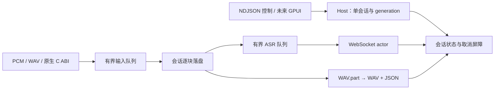

# 独立 Rust 会话核心与常驻验证

状态：独立后端已实现并在本机完成验证。用户确认本阶段完成 Rust 后端、会话核心和文件化录音，完整 GPUI 界面后续实施；保留 Python 产品代码、配置和发布路径。运行示例见 [Rust README](../rust/README.md)。

## 边界

- 新增 `rust/` workspace：`vocal-more-core` 是可嵌入的业务库，`vocal-more-host` 是独立 NDJSON/JSON-RPC 常驻进程。
- Rust 运行时不启动 Python，不加载 Python/PyObjC，不要求先安装 Python 应用。原生音频通过现有 C ABI 动态库接入，使用原有构建脚本。
- 本阶段实现 PCM 输入、WAV 文件回放输入、macOS 原生采集适配、Qwen 3.5 Omni Realtime 文本输出、取消与文件恢复。没有 GPUI、热键、粘贴、词典学习、全部模型适配或独立润色流程。
- 新录音只写显式指定的独立数据目录，不读写 `~/.vocal-more`。API Key 由环境变量提供，不进入状态、录音元数据或日志。

## 运行时与所有权

一个 Tokio runtime 使用两个 worker。Host 串行接收控制命令；一次只拥有一个会话。会话包含独立 generation、状态通道、取消信号、有界 PCM 队列、WebSocket 和文件写入器。

PCM 固定为 16 kHz / mono / little-endian PCM16。输入块不大于 1,280 bytes；输入队列与 ASR 队列各最多 160 块，两者合计约 400 KiB 原始 PCM，不包含当前处理块和原生库队列。网络按 3,200 bytes 合并，最后一个部分帧必须先发出再 commit。录音通过 64 KiB BufWriter 顺序落盘，不保留完整 PCM，不在停止时整段 join。

取消通过独立信号唤醒正在等待连接、网络或队列的任务。旧 generation 的输入必须被拒绝。关闭 stdin 和 shutdown 都取消活动会话并等待有界退出。原生设备调用只在普通线程执行；超时后拒绝迟到数据，不强制销毁仍被设备调用使用的句柄。

| 等待点 | 上限或处理规则 |
| --- | --- |
| 音频源启动 | 3 秒；失败后隔离迟到结果 |
| 原生音频无 PCM | 3 秒；避免 native read 卡住时永久停留在 recording |
| 原生停止排空 | 500 ms；超时仍由原 owner 负责清理，busy 未释放前拒绝再次采集 |
| WebSocket 建连 / session.updated | 各 10 秒 |
| 单次发送 | 10 秒 |
| commit 后等待完整文本 | 120 秒 |
| Host shutdown | 5 秒；超时遗留文件由下次启动恢复 |

取消只在安全等待点打断会话，不中途丢弃正在执行的文件写入；随后把有界队列中已接收的 PCM 排空到文件。进入最终提交前通过互斥屏障决定取消是否仍能接受；已接受的取消不能发布 completed 文本。存储故障仍可能使取消后的文件提交失败，此时明确返回 failed。

原生句柄仅由创建它的普通线程调用和销毁。销毁前显式检查 stop 成功；若不能证明回调停止，保留句柄并设置 `native_quarantined=true`，重启 host 前拒绝新设备采集，文件和 PCM 输入仍可使用。由于现有 `vm_audio_destroy` 返回 void 且在不安全时会保留句柄，Rust 还将动态库固定到进程退出，防止仍存活的回调跳入已卸载代码。当前每个 host 只需加载一次库；不提供运行中反复热加载机制。

## 文件契约

录音以 UUID 标识，创建时使用独占文件创建。活动 WAV 使用 `.part` 后缀；成功、取消与失败都完成可播放文件头，保存状态元数据。异常退出遗留文件在下一次启动时恢复为 interrupted，不能假报识别成功。成功状态只能在音频、ASR 完成和元数据提交均成功后发布。

本阶段记录独立的 Rust 文件格式版本，不声称已与 Python 历史索引双向迁移。以后由适配层连接已有历史与重试功能。

WAV 上限为 RIFF 的约 4 GiB，PCM16 必须按完整样本写入。完成流程为：flush → 按实际字节修正 WAV 头 → sync → 重命名 WAV → 写临时 JSON 并 sync → 重命名元数据；Unix 还同步目录。恢复覆盖 `.part` 遗留以及 WAV 已重命名但 JSON 尚未完成的两个阶段。

强制终止可恢复已写入磁盘文件的完整 PCM 前缀，不能保证恢复尚在应用队列或 64 KiB 缓冲区中的尾部，也不构成断电零丢失承诺。异常或格式损坏会保留文件并报错，不自动覆盖。取消、失败和 interrupted 都清空 transcript。

当前历史查询读取独立 JSON sidecar，不自动清理、压缩或删除录音。WAV 磁盘成本约为每分钟 1.83 MiB；分页、保留策略、压缩、删除与 Python 索引导入仍需后续迁移，不能把这条 API 当成大量历史记录的最终实现。

## 验证

已用本地 WebSocket 协议夹具验证握手、PCM 字节与尾帧、文本完成、错误、取消及重复会话，并用 C ABI 夹具验证设备阻塞边界。测量 release 构建的启动、文件输入、结束后、取消后和多次循环后的 physical footprint/RSS/线程/连接。具体数据与真实设备、云端验证边界见 [性能报告](rust-core-performance-2026-09-11.md)。

使用现有 Python 后台服务作为更接近的参考；必须列出两边加载的能力。完整 Python 菜单应用约 95 MiB 的历史数据不能直接作为 Rust 后台净节省的分母。

## 迁移覆盖

| 能力 | 本阶段状态 | 接下来要补的内容 |
| --- | --- | --- |
| 单会话、generation、停止、取消、错误隔离 | 已实现并测 | GPUI 事件订阅和更完整的交互状态 |
| 文件化 PCM、终态提交、崩溃恢复 | 已实现并测 | 历史迁移、保留与压缩、录音重试 |
| Qwen 3.5 Omni Realtime | 协议与错误路径已实现，本地夹具通过 | 真实账户、网络中断、识别质量和长录音分段 |
| 原生音频 / 低声 DSP | 复用 C ABI；加载与生命周期夹具通过 | 真麦克风、权限、低声、设备切换、冷暖启动与丢块验收 |
| Python 现有配置、词典、计费、润色、Prompt | 未迁移 | 按当前行为逐项补齐 |
| GPUI Kit、胶囊、热键、粘贴、升级 | 下一阶段 | UI 性能、辅助功能和完整产品发布验收 |
| Windows 平台采集 | 未实现 | Windows 音频与系统集成适配；共享核心已有 CI 配置 |

## 依赖依据

2026-09-11 核验 GPUI Kit 最新正式发布仍为 `v0.6.1`（commit `36b5181`）；本阶段不加载 UI 依赖，后续开始界面阶段再次核对并锁定。Rust 实際依赖由 `rust/Cargo.lock` 锁定。

协议依据为 [Qwen-Omni-Realtime 官方文档](https://www.alibabacloud.com/help/zh/model-studio/realtime) 及当前 Python 的 `BufferedRealtimeConversation`：`session.update` → `session.updated` → PCM append → commit → `response.create` → text/response.done → close。
